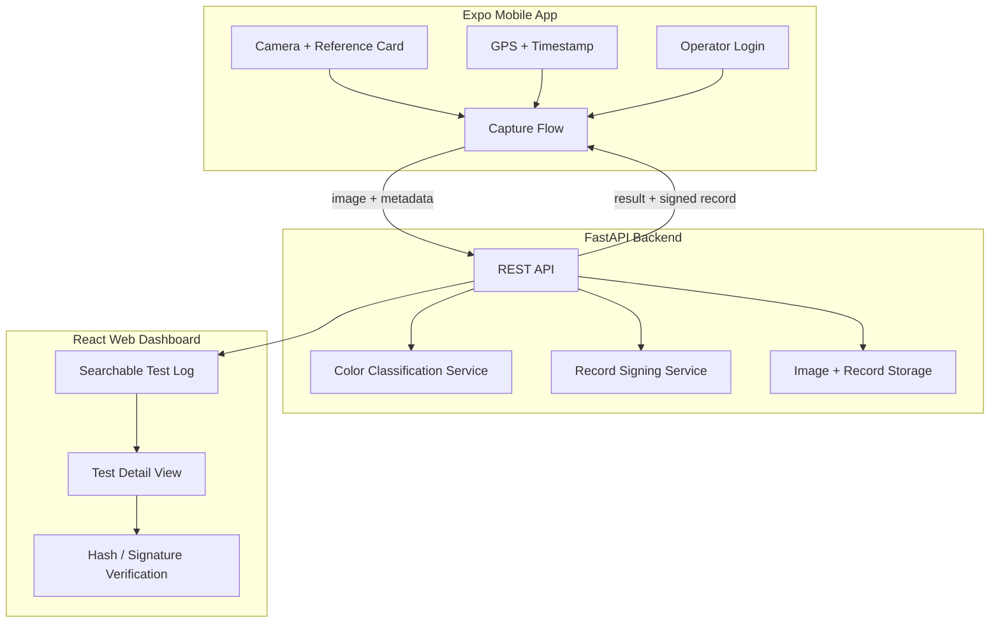
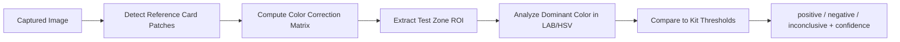

# Digital Companion for Field Drug Testing

## Context

`[SIH_NEXT](/Users/adarsh/Downloads/SIH_NEXT)` is empty — this is a **greenfield build**. The nearby `SIH.zip` is an unrelated policy analytics app and will not be reused.

**Your choices:** Expo mobile + React web dashboard; hybrid classification (rule-based first, ML later).

---

## High-Level Architecture




---

## Tech Stack


| Layer               | Choice                                                                        | Rationale                                |
| ------------------- | ----------------------------------------------------------------------------- | ---------------------------------------- |
| Mobile              | **Expo (React Native)** + `expo-camera`, `expo-location`, `expo-image-picker` | Native camera/GPS; fast SIH prototype    |
| Web dashboard       | **React + Vite + TypeScript + Tailwind**                                      | Searchable admin UI; matches mobile API  |
| Backend             | **FastAPI + Python 3.11+**                                                    | Strong fit for OpenCV/color pipeline     |
| CV / classification | **OpenCV + NumPy** (Phase 1); **TensorFlow Lite** (stretch)                   | Explainable color rules first            |
| Database            | **SQLite** (dev) / **PostgreSQL** (prod) via SQLAlchemy                       | Simple local demo; production-ready path |
| Auth                | **JWT** with operator badge ID                                                | Lightweight field-officer login          |
| Integrity           | **SHA-256** image hash + **HMAC-SHA256** record signature                     | Tamper-evident without heavy PKI         |
| Image storage       | Local filesystem (dev); S3-compatible bucket (prod)                           | Keeps prototype simple                   |


---

## Monorepo Layout

```
SIH_NEXT/
├── mobile/                 # Expo app
│   ├── app/                # Expo Router screens
│   ├── components/         # Camera overlay, result card, reference card guide
│   ├── services/           # API client, location, auth
│   └── app.json
├── backend/
│   ├── app/
│   │   ├── main.py
│   │   ├── api/routes/     # auth, tests, kits
│   │   ├── models/         # Operator, TestRecord, KitType
│   │   ├── schemas/
│   │   ├── services/
│   │   │   ├── classification.py   # OpenCV color pipeline
│   │   │   ├── integrity.py        # hash + HMAC signing
│   │   │   └── storage.py
│   │   └── config.py
│   ├── requirements.txt
│   └── alembic/            # optional migrations
├── web/
│   ├── src/
│   │   ├── pages/          # Login, TestLog, TestDetail, Dashboard
│   │   ├── components/
│   │   └── services/api.ts
│   └── package.json
├── shared/                 # Shared TypeScript types (optional)
├── docs/
│   └── reference-card.md   # Reference card spec for officers
└── README.md
```

---

## Core Data Model

`**TestRecord**` (primary entity):

- `id` (UUID)
- `operator_id` (FK → Operator)
- `kit_type_id` (FK → KitType)
- `result` — enum: `positive` | `negative` | `inconclusive`
- `confidence` — float 0–1 from classifier
- `captured_at` — UTC timestamp (server + device)
- `latitude`, `longitude`, `location_accuracy_m`
- `image_path` / `image_url`
- `image_hash` — SHA-256 of raw image bytes
- `record_hash` — SHA-256 of canonical record payload (excludes signature)
- `signature` — HMAC-SHA256(`record_hash`, server secret)
- `classification_details` — JSON (dominant color, reference card detected, thresholds used)
- `notes` — optional officer notes

`**KitType**` — e.g. "Marquis", "Mecke", "Scott" with per-kit color thresholds:

- `positive_hue_range`, `negative_hue_range`, `inconclusive_range`
- Reference outcome color samples (HSV/LAB values)

`**Operator**` — badge ID, name, role, password hash

---

## Feature Breakdown

### 1. Mobile Capture Flow (Expo)

Screens (Expo Router):

1. **Login** — badge ID + PIN/password → JWT
2. **New Test** — select kit type from dropdown
3. **Capture** — full-screen camera with overlay:
  - Guide frame for test kit + reference color card (printable 6-patch card: white, 18% gray, red, green, blue, black)
  - Shutter button; reject if reference card not detected (Phase 1: warn, allow override)
4. **Review** — show captured image, GPS pin, timestamp, operator
5. **Result** — display classification + confidence; officer confirms or marks inconclusive
6. **Record Saved** — show record ID, image hash, signature; option to start next test

Key mobile files to create:

- `[mobile/app/(tabs)/capture.tsx](mobile/app/(tabs)`/capture.tsx) — camera + overlay
- `[mobile/components/ReferenceCardOverlay.tsx](mobile/components/ReferenceCardOverlay.tsx)`
- `[mobile/services/api.ts](mobile/services/api.ts)`

### 2. Reference Card Calibration (Rule-Based Classifier)

Pipeline in `[backend/app/services/classification.py](backend/app/services/classification.py)`:




Steps:

1. **Detect reference card** — contour/color clustering to find 6 known patches (or use fixed overlay position if card placement is standardized in UI)
2. **Calibrate lighting** — map observed patch colors → known sRGB values; apply correction to full image
3. **Extract test zone** — officer taps region on review screen, or fixed ROI relative to card (configurable per kit)
4. **Classify** — compute median LAB/HSV of test zone; compare to `KitType` thresholds; return nearest category + distance-based confidence
5. **Inconclusive** — if confidence below threshold or ambiguous between positive/negative → `inconclusive`

This is **explainable** for judges: show corrected swatch vs expected colors in the UI.

### 3. Tamper-Evident Digital Record

`[backend/app/services/integrity.py](backend/app/services/integrity.py)`:

1. Compute `image_hash = SHA256(image_bytes)`
2. Build canonical payload: `{id, operator_id, kit_type, result, captured_at, lat, lng, image_hash}`
3. `record_hash = SHA256(json.dumps(payload, sort_keys=True))`
4. `signature = HMAC-SHA256(record_hash, SIGNING_SECRET)`

Verification endpoint: `GET /tests/{id}/verify` recomputes hashes and validates signature + re-hashes stored image.

Optional export: JSON record + QR code linking to verification URL (good demo moment).

### 4. Searchable Test Log (Web Dashboard)

Pages:

- **Login** — same JWT auth
- **Test Log** — table with filters: date range, operator, kit type, result, location text search
- **Test Detail** — image, map pin (Leaflet/OpenStreetMap), all metadata, verify button, classification breakdown
- **Dashboard** — counts by result, tests per day (simple charts)

Key web files:

- `[web/src/pages/TestLog.tsx](web/src/pages/TestLog.tsx)`
- `[web/src/pages/TestDetail.tsx](web/src/pages/TestDetail.tsx)`

API: `GET /tests?operator=&result=&from=&to=&q=` with pagination.

### 5. Stretch Goal: ML Classification

- Collect labeled images from rule-based flow (officer-confirmed results)
- Train lightweight **MobileNetV3** or color-feature + **Random Forest** classifier
- Export to **TFLite** for on-device inference in Expo (via `expo-tflite` or send to backend)
- Fallback: if ML confidence low, use rule-based result
- Keep in `backend/app/services/ml_classification.py` behind feature flag

---

## API Endpoints (Minimum)


| Method | Path                 | Purpose                                           |
| ------ | -------------------- | ------------------------------------------------- |
| POST   | `/auth/login`        | Operator login → JWT                              |
| GET    | `/kits`              | List kit types + thresholds                       |
| POST   | `/tests`             | Upload image + metadata → classify + sign + store |
| GET    | `/tests`             | Searchable log (filters, pagination)              |
| GET    | `/tests/{id}`        | Single record detail                              |
| GET    | `/tests/{id}/verify` | Integrity verification                            |
| GET    | `/tests/{id}/image`  | Serve captured image                              |


---

## Reference Color Card Spec

Ship a printable PDF/SVG in `[docs/reference-card.md](docs/reference-card.md)`:

- 6 patches: White, 18% Gray, Red (sRGB 255,0,0), Green, Blue, Black
- Printed size: ~5×3 cm card placed beside test kit in frame
- Mobile overlay shows placement guide

This satisfies the problem requirement for **in-frame lighting calibration** without new hardware.

---

## Security and Compliance Notes (for demo)

- Clearly label output as **presumptive field-test result** (disclaimer on every result screen)
- JWT expiry + HTTPS in production
- `SIGNING_SECRET` in env, never committed
- GPS accuracy displayed so officers know when location is unreliable
- No PII beyond operator badge ID in prototype

---

## Implementation Phases

### Phase 1 — Foundation (Days 1–2)

- Scaffold monorepo: Expo, FastAPI, React web
- DB models, auth, basic API
- Mobile login + camera capture (no classification yet)
- Web test log (empty state)

### Phase 2 — Core Pipeline (Days 3–4)

- Reference card detection + color calibration
- Rule-based classifier for 1–2 kit types (e.g. Marquis: purple = positive, orange = negative)
- Tamper-evident record creation + verification
- End-to-end mobile → backend → web flow

### Phase 3 — Polish (Days 5–6)

- Search/filters on web dashboard
- Map view, export record JSON, QR verification
- Reference card printable asset + in-app guide
- Error handling, offline queue (optional: store locally, sync when online)

### Phase 4 — Stretch

- ML model training pipeline
- Multi-kit support UI
- PDF report generation

---

## Demo Script (for judges)

1. Officer logs in on mobile with badge ID
2. Selects kit type, places test kit + reference card, captures photo
3. App shows GPS, timestamp, auto-classified result with confidence + color swatch comparison
4. Record saved with SHA-256 hash displayed
5. Switch to web dashboard → search by operator/date → open record → verify signature
6. Show disclaimer: presumptive result, lab confirmation required

---

## Key Risks and Mitigations


| Risk                          | Mitigation                                                                    |
| ----------------------------- | ----------------------------------------------------------------------------- |
| Poor lighting outdoors        | Reference card calibration + inconclusive fallback                            |
| Reference card not detected   | Fixed overlay placement + manual ROI tap on review                            |
| No real kit images for demo   | Seed kit thresholds from published color charts; use food-coloring mock tests |
| Expo camera quirks on Android | Test early on physical device; fallback to `expo-image-picker`                |


---

## Dependencies to Install

**Backend:** `fastapi`, `uvicorn`, `sqlalchemy`, `python-multipart`, `opencv-python-headless`, `numpy`, `pillow`, `python-jose`, `passlib`, `pydantic-settings`

**Mobile:** `expo`, `expo-camera`, `expo-location`, `expo-secure-store`, `@tanstack/react-query`

**Web:** `react`, `vite`, `tailwindcss`, `axios`, `react-router-dom`, `leaflet` (maps)