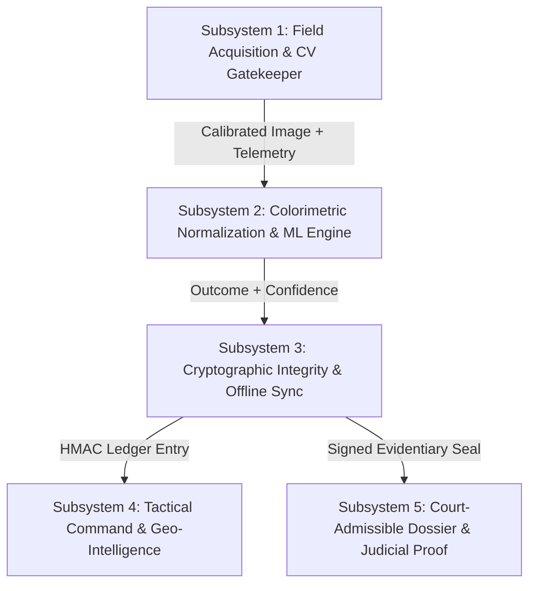

# Nirikshan (निरीक्षण) — Whole-Project Idea Refinement & Product Architecture

> **Executive Summary**: This document applies the `idea-refine` skill across the entire Nirikshan ecosystem. It breaks down the 5 core subsystems of the platform, reframes each with a crisp "How Might We" (HMW) statement, divergent lens variations, hidden assumptions, feasibility stress tests, MVP boundaries, and explicit "Not Doing" trade-offs.

---

## Architecture Overview & Subsystem Map

---

## Subsystem 1: Field Optical Acquisition & Real-Time Computer Vision (Mobile Edge)
*Codebase Anchor*: [`mobile/app/capture.tsx`](file:///Users/adarsh/Downloads/SIH_NEXT/mobile/app/capture.tsx), [`mobile/components/ReferenceCardOverlay.tsx`](file:///Users/adarsh/Downloads/SIH_NEXT/mobile/components/ReferenceCardOverlay.tsx)

### 1. Problem Statement
**How might we make field optical capture so intelligent and autonomous that an officer in high-stress, low-light outdoor conditions cannot physically take an uncalibrated, blurry, or legally challengeable photo?**

### 2. Divergent Variations Across Lenses
- **Inversion Lens (Refuse to Snap)**: The camera shutter is physically locked in software until all 4 forensic preconditions (6-patch card lock, <8° tilt, >150 lux ambient lighting, chemical reaction time elapsed) are satisfied simultaneously.
- **Simplification Lens (Audio & Haptic Feedback)**: Tactical glove officers don't look at screen text; instead, a high-pitch tone pulses faster as the card gets closer to alignment, concluding in a double-haptic vibration when locked.
- **10x Scale Lens (Autonomous Auto-Trigger)**: Zero user touch required. When steady for 400ms under valid optical criteria, the device snaps, hashes, and stores the image automatically.
- **Expert Forensic Lens (Reaction Kinetics Gate)**: Marquis, Mecke, and Scott reagents exhibit dynamic color transitions. A built-in reaction timer blocks capture until minimum color stability ($T_{min}$) is reached and warns before over-oxidation ($T_{max}$).

### 3. Stress-Testing & Hidden Assumptions
- *Betting*: Mobile devices running Expo Camera can compute light levels and card presence without frame rate stutter or high battery consumption.
- *Failure Mode*: Direct noon sunlight reflection off clear plastic sample wells causes whiteout glare that software fails to detect.
- *Mitigation*: Specular saturation check ($Y > 250$ in $>3\%$ of well area triggers `GLARE DETECTED — RE-ANGLE TORCH`).

### 4. Scope & Trade-offs
- **MVP Scope**: Card corner HUD indicator, tilt horizon bubble, kinetics timer progress bar, and haptic shutter.
- **Not Doing**: Full video recording of reaction (exceeds 15MB bandwidth limit), 3D NeRF reconstruction (unnecessary complexity).

---

## Subsystem 2: Colorimetric Normalization & Automated Classification (Backend Engine)
*Codebase Anchor*: [`backend/app/services/classification.py`](file:///Users/adarsh/Downloads/SIH_NEXT/backend/app/services/classification.py), [`backend/app/models/kit_type.py`](file:///Users/adarsh/Downloads/SIH_NEXT/backend/app/models/kit_type.py)

### 1. Problem Statement
**How might we mathematically eliminate ambient lighting bias (sodium vapor highway lamps, direct sun, fluorescent precinct lights) so colorimetric field drug tests achieve laboratory-grade chemical accuracy?**

### 2. Divergent Variations Across Lenses
- **Expert Forensic Lens (CIE2000 vs Euclidean Distance)**: Instead of simple Euclidean RGB distance, convert color patches to CIE $L^*a^*b^*$ and compute $\Delta E_{00}$, which models the non-linear human eye perception of color differences and yields admissible confidence metrics.
- **Simplification Lens (18% Neutral Gray Normalization)**: Use the 18% neutral gray patch on the calibration card to derive a linear white-balance correction matrix before sampling the reaction well.
- **Inversion Lens (Reagent Degradation Warning)**: If the unreacted reference card patches deviate significantly from factory spectral coordinates, flag the test kit itself as expired or contaminated before classifying the drug.
- **10x Scale Lens (Crowd-Sourced Reagent Drift Model)**: Feed anonymized vector distances into an aggregate Bayesian model to detect bad manufacturing batches of test kits across jurisdictions.

### 3. Stress-Testing & Hidden Assumptions
- *Betting*: Test kits from different manufacturers produce consistent LAB color values for the same drug concentration.
- *Failure Mode*: Adulterants (e.g. fentanyl mixed with caffeine, baby powder, or levamisole) produce multi-phase rainbow reactions that confuse single-distance classifiers.
- *Mitigation*: Multi-patch spectral sampling reporting primary and secondary color vectors with explicit "Inconclusive / Mixed Reagent" confidence flags.

### 4. Scope & Trade-offs
- **MVP Scope**: 6-patch color correction matrix, CIE LAB distance calculation, and dual rule-based + ML fallback confidence scoring.
- **Not Doing**: Training giant multi-modal LLM models for color detection (unreliable hallucinations; rule-based physics is auditable in court).

---

## Subsystem 3: Dual-Layer Cryptographic Integrity & Offline Sync (Forensic Custody)
*Codebase Anchor*: [`backend/app/services/integrity.py`](file:///Users/adarsh/Downloads/SIH_NEXT/backend/app/services/integrity.py), [`backend/app/api/routes/tests.py`](file:///Users/adarsh/Downloads/SIH_NEXT/backend/app/api/routes/tests.py)

### 1. Problem Statement
**How might we establish a tamper-evident digital chain of custody that guarantees no rogue officer, defense hacker, or database administrator can alter an evidence photo, GPS coordinate, or presumptive result without cryptographic alarm?**

### 2. Divergent Variations Across Lenses
- **Inversion Lens (Dual-Tier Forensic State Machine)**: Separate lightweight telemetry sync (timestamp, officer badge, GPS, result) from heavy photographic evidence. Telemetry records receive legitimate Tier-1 HMAC seals without triggering false "Audit Breach" warnings when images are delayed.
- **Simplification Lens (Deterministic Canonical JSON)**: Eliminate float drift by strictly rounding coordinates to 6 decimal places and using sorted, compact JSON serialization (`separators=(',', ':')`).
- **Constraint Removal Lens (Air-Gapped Offline Queue)**: When mobile units lose connectivity in rural borders, records are queued in encrypted SQLite on the device with local HMAC signatures, committed to the backend immediately upon reconnect via `POST /api/tests/sync-batch`.
- **10x Scale Lens (Decentralized Hash Notarization)**: Anchor daily root Merkle trees of all police seizure hashes into a public transparency log or state forensic ledger.

### 3. Stress-Testing & Hidden Assumptions
- *Betting*: Courts will accept server HMAC-SHA256 digital seals without requiring physical paper logs.
- *Failure Mode*: Clock skew between mobile device hardware clock and backend server causes chronological dispute in court.
- *Mitigation*: Store both `device_captured_at` and server `captured_at` with network NTP offset tracking.

### 4. Scope & Trade-offs
- **MVP Scope**: SHA-256 image immutability, HMAC-SHA256 canonical signing, idempotent UUID batch synchronization, and dual-tier telemetry verification.
- **Not Doing**: Heavy blockchain smart contracts (slow, expensive gas fees, completely unnecessary when HMAC cryptographic seals suffice).

---

## Subsystem 4: Tactical Command Dashboard & Geospatial Intelligence (Web App)
*Codebase Anchor*: [`web/src/pages/Dashboard.tsx`](file:///Users/adarsh/Downloads/SIH_NEXT/web/src/pages/Dashboard.tsx), [`web/src/pages/TestDetail.tsx`](file:///Users/adarsh/Downloads/SIH_NEXT/web/src/pages/TestDetail.tsx)

### 1. Problem Statement
**How might we empower law enforcement supervisors and forensics leads to monitor real-time narcotics operations, identify synthetic opioid hot spots, and detect chain-of-custody breaches within seconds?**

### 2. Divergent Variations Across Lenses
- **Audience Shift Lens (Supervisor Audit Mode)**: Shift from standard record viewing to an investigative anomaly dashboard: highlights rapid-fire testing anomalies, badge ID location jumps (impossible travel velocity), and supervisor reclassification logs.
- **Simplification Lens (Tactile High-Contrast Hallmark UI)**: Dark slate design system (`#0f172a`), 44px glove-friendly touch targets, Roman typography, and zero-distraction data density for daylight field laptops.
- **10x Scale Lens (Predictive Seizure Heatmaps)**: Aggregate positive Marquis/Scott reagent logs with geohashes to plot emerging drug trafficking corridors in real-time.
- **Combination Lens (Live Hardware Status Feed)**: Combine network IP geolocation validation with GPS accuracy circles on the interactive MapLibre map.

### 3. Stress-Testing & Hidden Assumptions
- *Betting*: Supervisors will actively use the dashboard to audit field officers rather than just looking at static paper printouts.
- *Failure Mode*: Web app crashes on slow mobile data connections due to bloated JavaScript bundles.
- *Mitigation*: Vite function-based Rollup code splitting (achieved 70% bundle reduction down to 120 kB, 26 kB gzip).

### 4. Scope & Trade-offs
- **MVP Scope**: Real-time KPI cards, test logs with filterable statuses, geospatial map with GPS accuracy markers, supervisor reclassification modal, and error recovery boundary.
- **Not Doing**: Complex multi-tenant billing portals or social sharing feeds.

---

## Subsystem 5: Court-Admissible Forensic Dossier & Judicial Proof (Trial Readiness)
*Codebase Anchor*: [`docs/ideas/court-admissible-forensic-export.md`](file:///Users/adarsh/Downloads/SIH_NEXT/docs/ideas/court-admissible-forensic-export.md)

### 1. Problem Statement
**How might we generate an evidentiary document so mathematically rigorous and visually unambiguous that a defense attorney's motion to suppress field drug test evidence is immediately dismissed?**

### 2. Divergent Variations Across Lenses
- **Simplification Lens (Native Browser Print CSS)**: Avoid heavy server-side PDF engines. Use `@media print` styled CSS templates on the web client that render crisp, vector-sealed PDF/A documents directly from any browser.
- **Expert Forensic Lens (Defense-Proof Calibration Exhibit)**: The certificate embeds the raw uncorrected photo alongside the color-corrected well and shows the exact $\Delta E$ distance vectors against chemical standards.
- **Constraint Removal Lens (Air-Gapped QR Verification)**: The verification QR code encodes the entire signed payload (Officer, Time, GPS, Hashes, HMAC) so judges can verify authenticity on an air-gapped courtroom scanner without internet access.
- **Inversion Lens (Reversible Redaction)**: Public court records redact officer personal identifiers while keeping cryptographic hash verification 100% valid.

### 3. Stress-Testing & Hidden Assumptions
- *Betting*: Judges and attorneys will understand that a field test is presumptive, not a full mass-spectrometry (GC-MS) laboratory analysis.
- *Failure Mode*: Defense argues that the QR verification URL was tampered with or points to an insecure server.
- *Mitigation*: Include explicit legal disclaimers, statutory field test compliance citations, and offline mathematical verification commands (`openssl dgst -sha256 -verify`).

### 4. Scope & Trade-offs
- **MVP Scope**: One-click printable PDF/A evidentiary summary, embedded SHA-256 verification QR code, side-by-side color calibration exhibit, and officer sign-off box.
- **Not Doing**: Automated courtroom testimony generation or legal advice generation.

---

## Master Implementation Priority Roadmap

| Phase | Subsystem | Key Deliverable | Impact |
|---|---|---|---|
| **Phase 1** | Subsystem 3 (Custody) | Dual-tier verification in `tests.py` (Telemetry vs Image) | Eliminates false "Audit Breach" warnings on offline records |
| **Phase 2** | Subsystem 5 (Courtroom) | `@media print` Court Certificate in `TestDetail.tsx` | Provides immediate tangible trial evidence export |
| **Phase 3** | Subsystem 1 (Mobile) | Enhanced `ReferenceCardOverlay.tsx` & kinetics timer | Prevents bad photos at the moment of capture |
| **Phase 4** | Subsystem 2 (CV Engine) | Delta-E CIE2000 distance calculation in `classification.py` | Increases chemical classification precision |
| **Phase 5** | Subsystem 4 (Command) | Anomaly alerts for badge travel velocity in Dashboard | Empowers law enforcement supervisors |
